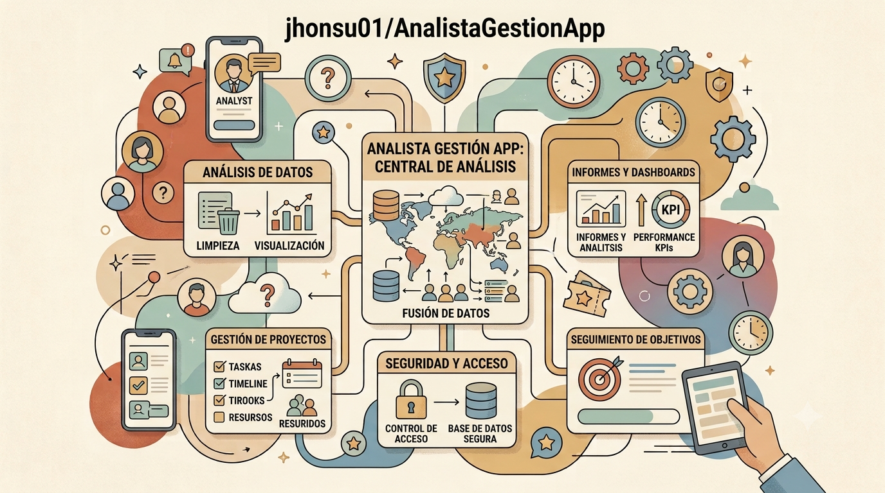

# Analista de Gestión Pública




Pregunta en lenguaje natural sobre los **informes de empalme del gobierno
colombiano** y obtén respuestas con la fuente citada: entidad, documento y
sección exacta. Todo se ejecuta en tu equipo.

> No es un buscador de palabras: entiende la pregunta. Puedes preguntar
> *"¿qué quedó pendiente en la red vial?"* y encuentra el párrafo correcto
> aunque no contenga esas palabras.

---

## Descarga

Los instaladores están en la [última release](../../releases/latest).

| Plataforma | Archivo | Requisitos |
| ---------- | ------- | ---------- |
| Windows 10/11 | `AnalistaGestion-x.y.z.msi` | Ninguno: instala sin permisos de administrador |
| Android 8+ | `analista-gestion-x.y.z.apk` | Un PC en la misma red WiFi ejecutando la app |

El APK está firmado en modo depuración, así que Android pedirá permitir
*orígenes desconocidos* la primera vez.

---

## Qué necesitas además

La aplicación **no incluye ni el modelo ni los datos**, y es a propósito: el
corpus pesa varios GB y el modelo otros tantos. Necesitas dos cosas:

**1. Un servidor de modelos local.** Cualquiera con API compatible con OpenAI:

- [LM Studio](https://lmstudio.ai) — el más sencillo, con interfaz gráfica
- [Ollama](https://ollama.com) — línea de comandos
- `llama-server` de llama.cpp

Hacen falta dos modelos: uno de **chat** (para redactar) y uno de
**embeddings** (para buscar).

> **Un modelo grande no es un modelo mejor aquí.** Medido en este proyecto:
> `gemma-4-e2b` con una ventana de **131.072 tokens** da mejores respuestas y
> gasta mucha menos memoria que `gemma-4-26b` limitado a 8.192. Un modelo
> pequeño al que le caben los fragmentos enteros gana a uno grande al que hay
> que recortarle el material. **Prioriza la ventana de contexto sobre el
> tamaño del modelo.**

**2. El índice del corpus**, una carpeta con:

```
embeddings.npy     matriz de vectores
metadatos.jsonl    una línea por vector
corpus.jsonl       el texto de cada fragmento
indice.tv          (opcional) índice comprimido, búsquedas más rápidas
```

Ese índice se genera a partir de los documentos públicos del
[portal Datálogo del DNP](https://datalogo.dnp.gov.co/informe-empalme), o de
**los documentos que tú quieras**.

---

## Construye el tuyo

El proyecto sirve para cualquier corpus: actas municipales, contratos,
normativa interna, documentación técnica. Todo el proceso está documentado:

- **[Guía: cómo construir tu propio RAG](docs/GUIA-RAG.md)** — el paso a paso
  completo, el hardware recomendado, el formato de datos y los errores que
  cuestan horas.
- **[Recomendaciones para publicar datos legibles por IA](docs/DATOS-PARA-LLM.md)**
  — dirigido a entidades públicas, con lo aprendido procesando 8.820
  documentos reales.

Para generar el índice desde tus propios datos:

```bash
python execution/construir_indice.py --corpus datos/corpus.jsonl --salida datos/indice
```

### Hardware recomendado

| Nivel | Equipo | Qué esperar |
| --- | --- | --- |
| Mínimo | 16 GB RAM, sin GPU | Corpus pequeño, respuestas en minutos |
| **Recomendado** | 16 GB RAM + GPU de 8-12 GB | Corpus completo, respuestas en segundos |
| Cómodo | 32 GB RAM + GPU de 16-24 GB | Modelos grandes con ventanas amplias |

El índice se lee con `mmap`, así que **no necesitas tener 1,3 GB libres en RAM**
para abrirlo. Un SSD ayuda más que memoria extra.

---

## Primer arranque

1. Abre la aplicación y pulsa **Ajustes**.
2. Indica la **carpeta del índice** y la **URL de tu servidor de modelos**
   (por defecto `http://localhost:1234/v1`).
3. Guarda. Si todo está bien verás cuántos fragmentos quedaron cargados.

Para usar el móvil, abre la app de escritorio en el PC y luego el APK: el
cliente busca el servidor solo en la red local. Si no lo encuentra, puedes
escribir la IP a mano.

---

## Qué hace por dentro

```
pregunta ─→ embedding ─→ búsqueda vectorial ─→ fragmentos ─→ modelo ─→ respuesta citada
                                                                 └─→ historial (SQLite)
```

Cada consulta queda guardada con su respuesta y sus fuentes, así que puedes
releerla, buscarla meses después y exportarla a Markdown para citarla.

**El sistema admite no saber.** Si los fragmentos recuperados no contienen la
respuesta, lo dice en vez de rellenar con conocimiento general. Un dato
inventado sobre presupuesto público es peor que un "no aparece en los
documentos".

---

## Compilar desde el código

```bash
python -m venv .venv && .venv\Scripts\pip install -r requirements.txt
```

```bash
python run_analista.py
```

Para los instaladores:

```bash
cargo build --release --manifest-path packaging/ventana/Cargo.toml
```

```bash
cd android && gradle assembleDebug
```

Los iconos de todas las densidades se regeneran con:

```bash
python execution/generar_iconos.py
```

---

## Advertencia sobre las fuentes

Los informes de empalme son **autorreportados** por cada entidad saliente:
reflejan lo que cada una dice de su propia gestión, no una auditoría
independiente. Trátalos como fuente primaria de lo que el Estado declara de sí
mismo, y verifica contra el documento original cuando algo sea decisivo. Cada
respuesta trae el archivo exacto para poder hacerlo.

## Licencia

MIT. Los documentos consultados son públicos, amparados por la Ley 1712 de
2014 de Transparencia y Acceso a la Información Pública de Colombia.

---

## Contacto e implementaciones

¿Quieres montar algo así con los datos de tu organización, o necesitas ayuda
para adaptarlo? Escríbeme:

**[serviciosconiabyjhonsu.com](https://serviciosconiabyjhonsu.com/)**

---

## Apoya el proyecto

Este proyecto es **gratuito y de código abierto**. Se hizo para que cualquiera
pueda preguntarle a los datos públicos sin depender de servicios de pago. Si te
resulta útil y quieres que siga creciendo:

[](https://ko-fi.com/V7V81LV7GX)
